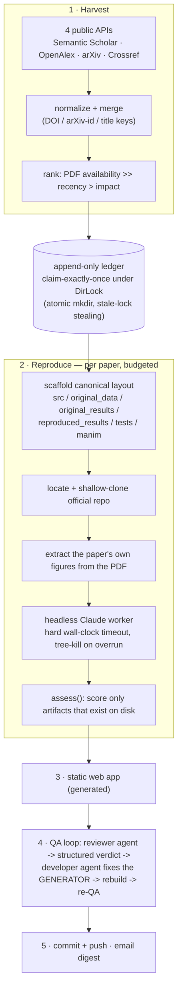

# Agentic AI Researcher

[](https://github.com/AmitAminov/agentic-research-advisor/actions/workflows/ci.yml)

An autonomous research-reproduction **harness**: it harvests recent AI/DS/ML/DL
papers from public APIs, then drives budgeted, headless Claude workers that
attempt a faithful CPU-scale reproduction of each paper's main result — and
records, machine-readably, how well each attempt actually went, including when
the answer is "it didn't".

The interesting artifact in this repository is the orchestration layer, not the
reproductions themselves.

> **Curated public snapshot.** This repository contains the harness (`scripts/`,
> `tests/`) and the dashboard **shell** (`webapp/`). The per-paper reproduction
> outputs — the `AI/`, `DS/`, `ML/`, `DL/` trees, harvested paper PDFs, and every
> extracted or reproduced figure — are intentionally **omitted** here (third-party
> paper content and repository size); they live in the private working repo. The
> dashboard is included to show the interface, with paper thumbnails and
> per-paper detail pages removed.

---

## What I built vs. what the agents produce

This distinction matters for anyone reviewing this repo:

| | Written/maintained by me (the harness) | Generated by agents (pipeline output) |
|---|---|---|
| **Where** | `scripts/` (~10k LOC Python + PowerShell), `tests/`, `.github/` | everything under `AI/`, `DS/`, `ML/`, `DL/`, and the built `webapp/` |
| **What** | harvester, dedup ledger, reproduction driver, prompt contracts, artifact scoring, QA repair loop, site generator, email digest | per-paper `src/`, `tests/`, figures, Manim scenes, `summary.md`, `metrics.json` |
| **Quality bar** | linted (ruff), unit-tested (pytest), CI on every push | budget-bounded worker output: artifact-scored and QA-gated by the harness, **not** hand-audited line by line |

Do not read the per-paper reproduction code as my hand-written research code.
It is what a 35-minute, CPU-only, headless agent run produces under the
harness's contracts — sometimes solid, sometimes incomplete, and the harness
says which is which.

## Problem

Reproducing published results is the boring, expensive part of research — and
the part LLM agents fail at most quietly: left unchecked, an agent will happily
hand-type "reproduced" numbers that were never computed. Running many such
agents unattended (several per day, every day, on one Windows machine)
compounds the problem: overlapping runs double-process papers, workers overrun
budgets, and failures disappear silently.

So the actual engineering problem is **meta-agentic**: build an orchestrator
whose contracts make unattended agent work *auditable* — every claim traceable
to an artifact on disk, every failure recorded as a failure.

## Architecture



Key pieces:

- **`scripts/fetch_papers.py`** — recency-aware harvester on top of
  `paper_pipeline.py` (multi-source retrieval, normalization, dedup, ranking).
- **`Ledger` + `DirLock`** (in `fetch_papers.py`) — the one shared mutable
  resource between overlapping runs. Claims are an atomic read-check-append
  under a lock built from `mkdir` (works on Windows, no `fcntl`), with
  stale-lock stealing so a crashed run cannot wedge the pipeline.
- **`scripts/reproduce.py`** — per-paper driver: scaffold, clone, extract
  figures, build the prompt contract, run the worker under a hard timeout,
  then `assess()` what actually landed on disk.
- **`scripts/qa_agent.py`** — generate→assess→repair loop for the web app: a
  reviewer agent writes a structured JSON verdict; on failure a developer agent
  is pointed at the *generator* (never the generated files), the site is
  rebuilt, and QA re-runs, up to an iteration budget.
- **`scripts/session_pipeline.ps1` / `daily_pipeline.ps1`** — Windows
  orchestrators (Task Scheduler / detached runners) that sequence the whole
  cycle and gate it behind a companion wiki-ingest backlog.

## Integrity design

The harness is built around the assumption that **agent output cannot be
trusted by default**:

- **Mandatory metrics schema.** Every reproduction must emit
  `reproduced_results/metrics.json`: named metrics with `paper_value`,
  `reproduced_value`, `abs_diff`, `within_tolerance`, plus an overall verdict —
  one of `full | partial | minimal | infeasible` — and a reason. An honest
  "partial" is explicitly preferred over a false "full", and the prompt says so.
- **Artifacts, not claims.** `assess()` never reads the agent's prose to decide
  whether something was produced; it counts files: source modules, reproduced
  images, test files, rendered animations, the metrics file. `produced=true`
  requires real artifacts.
- **Failure is a first-class result.** If a worker times out or leaves no
  write-up, the harness synthesizes a summary that says exactly that
  ("infeasible/incomplete — the agent run did not finish") rather than
  papering over it. Untrusted strings from workers are length-clamped before
  they enter reports.
- **Exactly-once processing.** A paper is claimed in the append-only ledger
  (keyed by normalized title + arXiv id + DOI) *before* download, under a
  directory lock, so near-simultaneous runs cannot both take it.
- **Bounded everything.** Per-paper wall-clock budgets, whole-phase deadlines
  (`--deadline-minutes`), QA iteration caps, and process-tree kill on timeout.
- **Secrets stay out of band.** `config.json` is gitignored; the GitHub token
  is read from an untracked file, passed only as an in-memory argument, and
  scrubbed from any captured output.

### Example: an honest negative result

`AI/language-critique-imitation-learning-from-suboptimal-demonstrations/`
(LC-IL) is the system working as designed. The worker faithfully re-implemented
the paper's method — structured language labels, a distilled differentiable
captioner, the clipped language-critique loss, and its diffusion variant — on a
scaled-down CPU maze, ran it, and recorded in `metrics.json`:

```json
"central_claims": {
  "LC-BC_beats_BC": false,
  "LC-BC_beats_reward_scalar": false,
  "LC-DP_beats_DP": false
}
```

At CPU scale, with a ~0.4M-parameter captioner standing in for a 135M one, the
paper's headline gains did **not** appear (LC-BC 0.675 vs. plain BC 0.95
success rate), and the summary explains why the scaled-down regime removes the
headroom for language supervision to win. The pipeline recorded the negative
result and moved on — no fabricated agreement, which is precisely the property
the whole harness exists to enforce.

## Results so far

The scheduled pipeline keeps attempting new papers, so any hard number here
goes stale by design: as of 2026-07-03 there are 16 per-paper folders on disk
(`state/processed_ledger.jsonl` and the generated web app always reflect the
current count). The outcome table below is a snapshot of the first 13
end-to-end attempts:

| Outcome | Count | Meaning |
|---|---|---|
| `partial` | 4 | core method reproduced and executed; headline numbers compared to the paper's, with documented scale-downs |
| honest negative | 1 | method reproduced, paper's central claims did not hold at CPU scale (LC-IL, above) |
| `infeasible/incomplete` | 8 | worker exceeded its budget before a complete write-up; the harness-generated summary says so explicitly |

That ratio is the honest cost of a 35-minute CPU budget per arbitrary frontier
paper. The harness's job is to make the ratio *visible*, and to let the
backfill queue retry and accumulate coverage day over day.

Coverage accumulates per area over time: harvests so far have landed in `AI/`
and `DS/`, while `ML/` and `DL/` are still empty scaffolds waiting for papers
the ranker files under those areas.

## Setup

**Platform:** the orchestration layer is Windows-oriented (PowerShell, Task
Scheduler, `taskkill`) and is run on Windows 11 + Python 3.10. The Python
harness code itself is cross-platform (CI runs the test suite on Ubuntu), but
the scheduled end-to-end pipeline assumes Windows.

```powershell
git clone <this repo>
cd AI_DS_ML_DL_Researcher
python -m venv .venv
.\.venv\Scripts\pip install -r requirements.txt
copy config.example.json config.json      # then edit as needed

# dry-run the harvester (no downloads):
.\.venv\Scripts\python.exe scripts\fetch_papers.py --dry-run --top-k 5
# reproduce today's harvest (requires the claude CLI on PATH or CLAUDE_EXE):
.\.venv\Scripts\python.exe scripts\reproduce.py
# rebuild the web app:
.\.venv\Scripts\python.exe scripts\build_webapp.py
# full gated cycle (harvest -> reproduce -> manim -> webapp -> QA -> sync -> report):
powershell -File scripts\session_pipeline.ps1 -Force
```

All paths resolve relative to the repo by default; `config.json` (gitignored)
and environment variables (`CLAUDE_EXE`, `RESEARCHER_REPO_ROOT`,
`GITHUB_TOKEN_FILE`) override them. GitHub push and email delivery are optional
and off by default — see `SETUP.md`.

`manim` is an **optional** pipeline dependency (deliberately not in
`requirements.txt`): it is only used to render the per-paper finding
animations, and `make_manim.py` degrades gracefully — recording the failure
rather than breaking the run — when manim or ffmpeg is not installed.

### Tests and CI

```
.\.venv\Scripts\pip install -r requirements-dev.txt    # pytest + ruff
.\.venv\Scripts\python.exe -m pytest tests -q          # 46 tests
.\.venv\Scripts\python.exe -m ruff check .
```

The suite covers the deterministic core: corpus dedup/normalization, the
`DirLock`/ledger concurrency guarantees, `assess()` artifact scoring, and
ranking/recency scoring. Agent-invocation paths are intentionally untested
(they are budget-bounded subprocess calls). CI (`.github/workflows/ci.yml`)
runs ruff + pytest on Ubuntu, Python 3.10 and 3.12.

## Limitations

- **Reproduction depth is budget-bound.** 35 CPU-minutes cannot retrain a
  frontier model; workers scale down (small/synthetic data, fewer epochs) and
  must document every deviation. Verdicts above `minimal` on GPU-scale papers
  should be read with that in mind.
- **The metrics schema is enforced by prompt, not by validation.** Some workers
  deviate from it (LC-IL's `metrics.json` is one example); `assess()` tolerates
  this but downstream digests get less structure. A JSON-schema validation +
  repair pass is the obvious next step.
- **QA is itself an agent.** The web-app QA verdict comes from a reviewer
  agent; it is structured and severity-gated, but not a formal check.
- **Harvest relevance is keyword-driven.** Broad recency queries surface
  physics/astronomy papers that merely *use* ML; area queries need tuning.
- **Repository weight.** Per-paper folders carry the original PDFs and media
  produced by reproductions on disk. Harvested PDFs, render intermediates, and
  bulk datasets are no longer tracked in git (`.gitignore` blocks them and the
  index has been pruned), but earlier commits still contain them; a history
  rewrite is planned before publication.

## Licensing

The harness code in this repository is released under the [MIT License](LICENSE).
Third-party material the pipeline pulls in per paper — harvested paper PDFs,
`upstream/` clones of the authors' official repositories, and bulk datasets
under `original_data/` — retains its own upstream licenses and is **not**
covered by the MIT grant; per-paper `PAPER_SOURCE.md` and `DATA_SOURCE.md`
files record where each item came from.

## Contact

Amit Aminov — amit.aminov@mail.huji.ac.il
